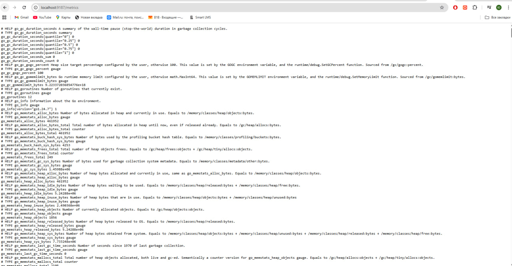
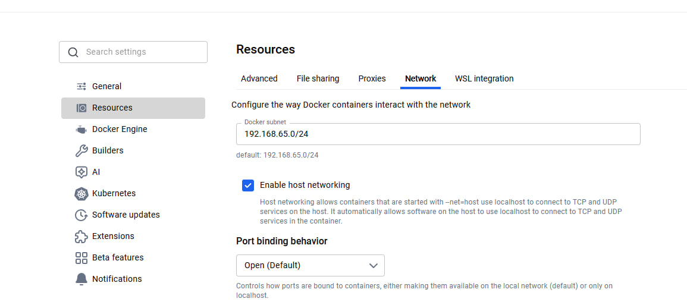
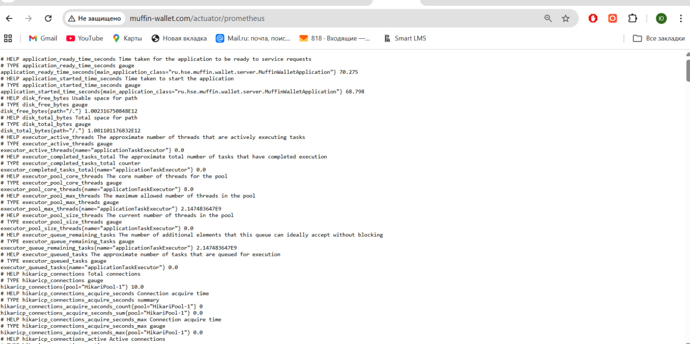
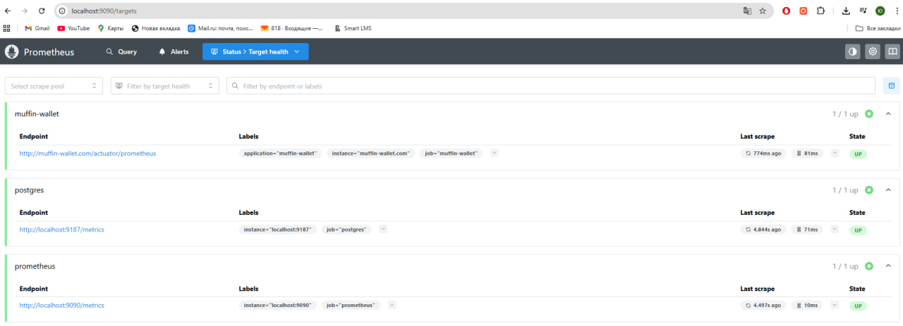
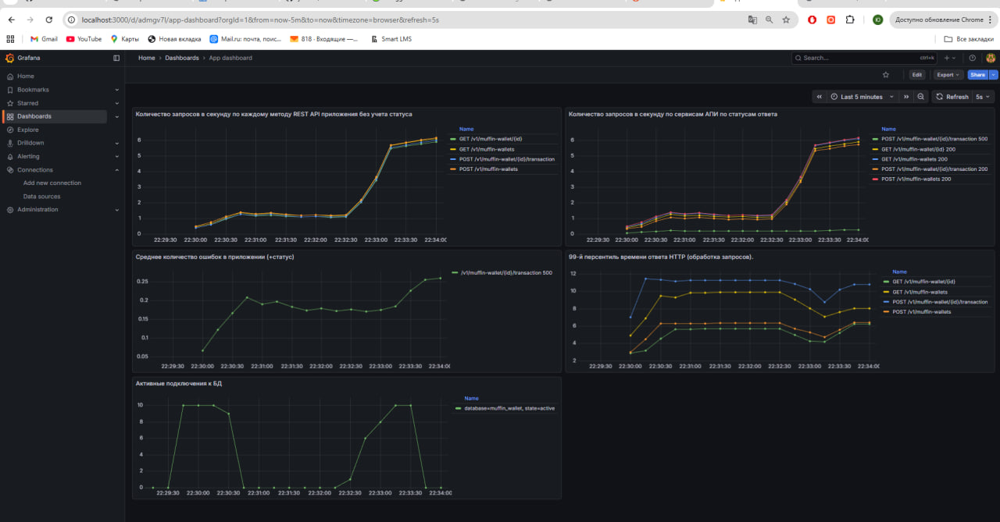

# ДЗ 1 по Prometheus. Промышленное развертывание промышленных приложений. Дедлайн 25.01.26

## Выполнила Кухтина Юлия Егоровна, БПИ224

## Выполненные шаги

### 1. Запускаем миникуб и поднимаем БД в докере
Из корневой папки проекта
```
minikube start --cpus=4 --memory=6g  --driver=docker
docker compose up -d
```

Отмечу, что в docker compose для базы появилась настройка для `postgres_exporter`, чтобы собирать метрики с базы данных, после запуска база будет отдавать метрики по адресу `http://localhost:9187/metrics`


### 2. Запускаем приложение с истио
Переходим в папку `charts` и устанавливаем и разворачиваем приложение с истио с помощью хельмфайла
```
cd charts
helmfile sync
```
### 3. Запускаем прометеус
Переходим в папку `prometheus` из корневой папки проекта и запускам прометеус в Docker \
`docker-compose.yml`
```
version: '3.8'

services:
  prometheus:
    image: prom/prometheus:latest
    network_mode: host
    container_name: prometheus
    volumes:
      - ./prometheus.yml:/etc/prometheus/prometheus.yml
      - prometheus_data_2:/prometheus
    command:
      - '--config.file=/etc/prometheus/prometheus.yml'
      - '--storage.tsdb.path=/prometheus'
      - '--storage.tsdb.min-block-duration=120s'
      - '--storage.tsdb.max-block-duration=120s'
    restart: unless-stopped

  grafana:
    image: grafana/grafana:latest
    container_name: grafana
    network_mode: host
    restart: unless-stopped
    volumes:
      - grafana_data:/var/lib/grafana

volumes:
  prometheus_data_2:
  grafana_data:
```
`prometheus.yml`
```
global:
  scrape_interval: 10s

scrape_configs:
  - job_name: 'muffin-wallet'
    metrics_path: /actuator/prometheus
    static_configs:
      - targets: ['muffin-wallet.com']
        labels:
          application: 'muffin-wallet'

  - job_name: 'postgres'
    static_configs:
      - targets: [ 'localhost:9187' ]

  - job_name: 'prometheus'
    static_configs:
      - targets: ['localhost:9090']
```

запуск:
```
docker compose up -d
```

#### Необходимо перед запуском проверить, что в докере включена опция "Enable host networking"


#### По адресу http://muffin-wallet.com/actuator/prometheus можно посмотреть, какие данные приложение предоставляет прометеусу


#### По адресу http://localhost:9090/targets можно увидеть, что прометеус успешно скрепит данные нашего приложения и базы


### Используется графана по адресу http://localhost:3000/ с логином/паролем admin/admin


### 4. Запросы PromQL

4.1. Среднее количество запросов в секунду по сервисам АПИ без уточнения статуса выполнения запроса
```
sum by(uri, method, instance) (
  rate(http_server_requests_seconds_count{uri=~"/v1/.*"}[5m])
)
```

4.2. Среднее количество запросов в секунду по сервисам АПИ по статусам ответа
```
rate(http_server_requests_seconds_count{uri=~"/v1/.*"}[5m])
```

4.3. Среднее количество ошибок в секунду по сервисам АПИ со статусами ответа
```
sum by(uri, status) (
  rate(http_server_requests_seconds_count{uri=~"/v1/.*", status=~"5..|4..|3.."}[5m])
)
```
4.4. 99-й персентиль времени ответа HTTP (обработка запросов).
```
histogram_quantile(
  0.99,
  sum by (le, uri, method) (
    rate(http_server_requests_seconds_bucket{uri=~"/v1/.*"}[5m])
  )
)
```
4.5. Активные подключения к БД
```
sum(pg_stat_activity_count{state="active", datname="muffin_wallet"}) by (datname, state)
```

#### Таким образом, из всех получившихся графиков был составлен дашборд, отражающий необходимые по заданию метрики:


#### Дашборд выгружен в формате json, его можно выгрузить в графану из папки `prometheus` в проекте

### 5. Тестирование

#### Для того, чтобы протестировать сбор метрик и дать небольшую нагрузку на приложение, был использован инструмент Jmeter. Для того, чтобы его использовать:

* Необходимо скачать с официального сайта архив https://jmeter.apache.org/download_jmeter.cgi
* Распаковать и добавить папку bin с исполняемыми файлами в path (если windows), можно ориентироваться на туториал https://habr.com/ru/articles/261483/
* В командной строке исполнить `jmeter.bat` и войти в GUI Jmeter, где можно удобно собрать скрипт для запуска
* В GUI по кнопке Open открыть скрипт из корня проекта `muffin-wallet.jmx`
* Скорректировать в HTTP-запросах данные, чтобы использовать id каких-то профилей, добавленных в базу заранее (ну или запросы просто попадут в неуспешные на графиках)
* Кнопкой Run запустить скрипт. Будет небольшая нагрузка на приложение в течение ~1.5 минут

#### При выполнении скрипта на графиках виден рост числа активных подключений к базе данных и количества запросов, что полностью соответствует реальному увеличению нагрузки на систему. Кроме того, анализ 99-го перцентиля времени отклика подтверждает ожидаемую логику работы: наибольшая задержка возникает при операции добавления транзакции, что объясняется дополнительным вызовом внешнего сервиса `muffin-currency`.
