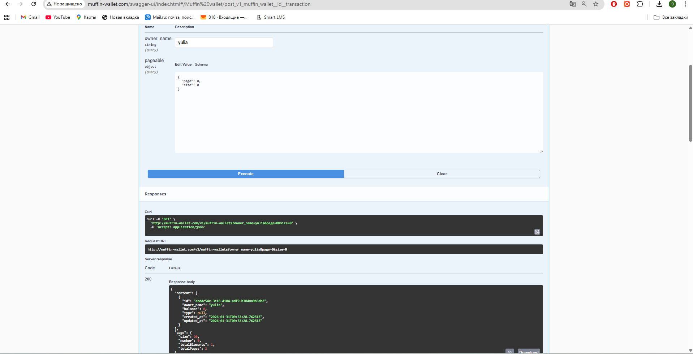
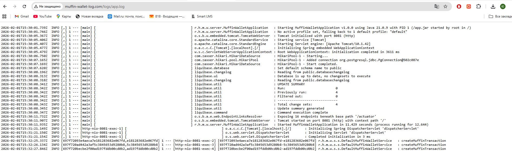
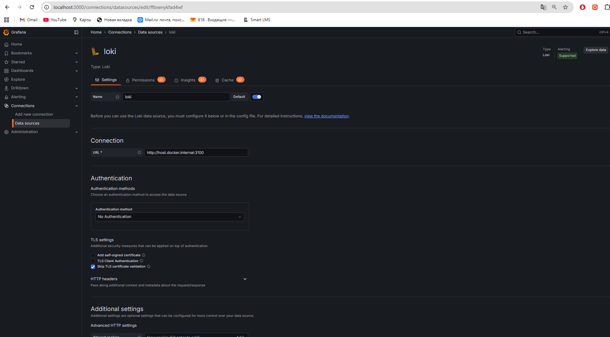
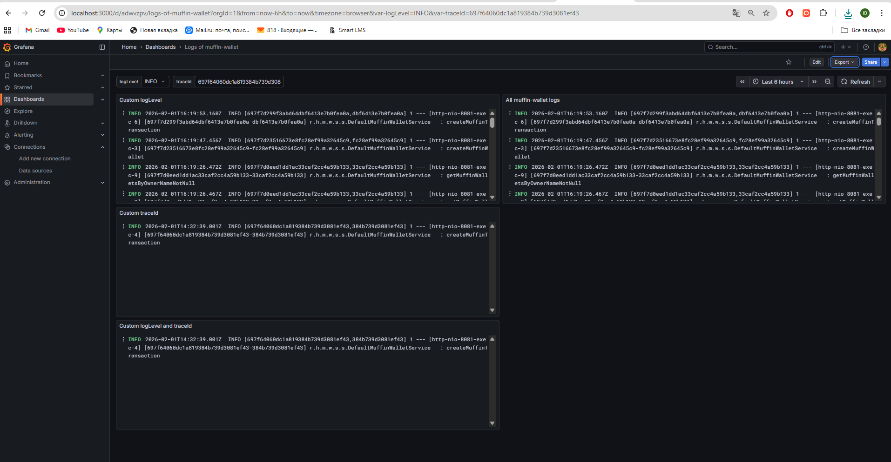
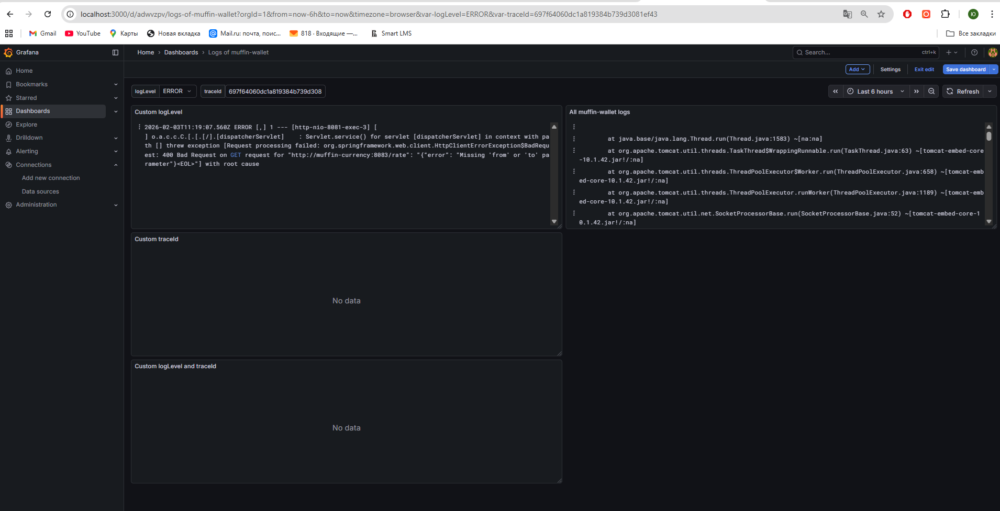
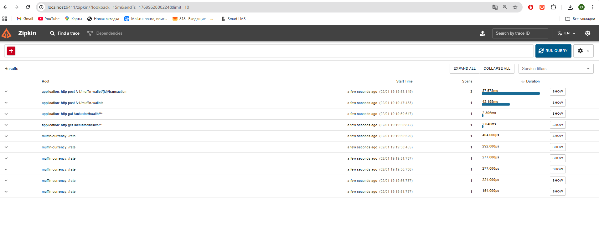

# ДЗ по логам и трейсам. Промышленное развертывание промышленных приложений. Дедлайн 03.02.26

## Выполнила Кухтина Юлия Егоровна, БПИ224

## Выполненные шаги

### 1. Запускаем миникуб и поднимаем все необходимые ресурсы в докере
Из корневой папки проекта
```
minikube start --cpus=4 --memory=6g  --driver=docker
docker compose up -d
```

### 2. Запускаем приложение с истио
Переходим в папку `charts` и устанавливаем и разворачиваем приложение с истио с помощью хельмфайла
```
cd charts
helmfile sync
```
В отдельном терминале исполняем команду, чтобы получить доступ к приложению в браузере
```
minikube tunnel
```
### 3. Основные изменения для выполнения дз

#### 3.1. promtail был развернут как отдельный контейнер в поде приложения `muffin-wallet`, чтобы собирать логи и отправлять их в `loki` \\

`promtail-configmap.yml`
```
apiVersion: v1
kind: ConfigMap
metadata:
  name: promtail-config
  namespace: default
data:
  config.yaml: |
    server:
      http_listen_port: 9080
      grpc_listen_port: 0

    positions:
      filename: /tmp/positions.yaml
    
    clients:
      - url: http://host.minikube.internal:3100/loki/api/v1/push
    
    scrape_configs:
      - job_name: app-logs
        pipeline_stages:
          - regex:
              expression: ^(?P<timestamp>\S+)\s+(?P<logLevel>INFO|ERROR|WARN|DEBUG)\s+\[(?P<traceId>[a-f0-9]*),(?P<spanId>[a-f0-9]*)\]
          - labels:
              traceId:
              logLevel:
        static_configs:
          - targets:
              - localhost
            labels:
              job: muffin-wallet
              __path__: /logs/*.log
```
`deployment.yml`
```
apiVersion: apps/v1
kind: Deployment
metadata:
  name: release-name-muffin-wallet
  labels:
    helm.sh/chart: muffin-wallet-0.1.0
    app.kubernetes.io/name: muffin-wallet
    app.kubernetes.io/instance: release-name
    app.kubernetes.io/version: "1.1.0"
    app.kubernetes.io/managed-by: Helm
spec:
  replicas: 1
  selector:
    matchLabels:
      app.kubernetes.io/name: muffin-wallet
      app.kubernetes.io/instance: release-name
  template:
    metadata:
      labels:
        app.kubernetes.io/name: muffin-wallet
        app.kubernetes.io/instance: release-name
    spec:
      serviceAccountName: muffin-wallet-sa
      volumes:
        - name: application-config-volume
          configMap:
            name: release-name-muffin-wallet
        - name: nginx-config-volume
          configMap:
            name: nginx-config
        - name: log-volume
          emptyDir: { }
        - name: promtail-config
          configMap:
            name: promtail-config
      containers:
        - name: nginx-log
          image: nginx:1.29.3
          volumeMounts:
            - name: nginx-config-volume
              mountPath: /etc/nginx
            - name: log-volume
              mountPath: /usr/share/nginx/html
        - name: promtail
          image: grafana/promtail:latest
          args:
            - -config.file=/etc/promtail/config.yaml
          volumeMounts:
            - name: log-volume
              mountPath: /logs
            - name: promtail-config
              mountPath: /etc/promtail

        - name: muffin-wallet
          image: "yuulkht/muffin-wallet:1.0.4"
          imagePullPolicy: Always
          ports:
            - name: http
              containerPort: 8081
              protocol: TCP
          volumeMounts:
            - name: application-config-volume
              mountPath: /app/config
            - name: log-volume
              mountPath: /logs
          envFrom:
            - secretRef:
                name: release-name-muffin-wallet
            - configMapRef:
                name: release-name-muffin-wallet-env
          livenessProbe:
            httpGet:
              path: /actuator/health/liveness
              port: 8081
            initialDelaySeconds: 90
            periodSeconds: 15
            timeoutSeconds: 5
            failureThreshold: 3
          readinessProbe:
            httpGet:
              path: /actuator/health/readiness
              port: 8081
            initialDelaySeconds: 80
            periodSeconds: 10
            timeoutSeconds: 3
            failureThreshold: 3
```

#### 3.2. В дз я использовала истио, поэтому скорректировала ServiceEntry в ресурсах истио, чтобы из кластера был доступ к ресурсам, которые я еще развернула в докере (не только база, но и loki, zipkin)
```
apiVersion: networking.istio.io/v1alpha3
kind: ServiceEntry
metadata:
  name: external-postgres
  namespace: default
spec:
  hosts:
    - host.minikube.internal
  ports:
    - name: postgres
      number: 5432
      protocol: TCP
    - name: zipkin
      number: 9411
      protocol: HTTP
    - name: loki
      number: 3100
      protocol: HTTP
    - name: grafana
      number: 3000
      protocol: HTTP
  location: MESH_EXTERNAL
  resolution: DNS
```
### 4. После запуска
#### 4.1. Swagger доступен по адресу http://muffin-wallet.com/swagger-ui/index.html
Он должен быть работоспособен и возвращать корректные коды ответа при выполнении HTTP-запросов, скрин:

#### 4.2. Логи приложения доступны на http://muffin-wallet-log.com/logs/app.log 


### 5. Используется графана по адресу http://localhost:3000/ с логином/паролем admin/admin
С помощью нее посмотрим на логи, которые собираются из приложения `muffin-wallet`: по идее, должны автоматом подтянуться Data source Loki и дашборд, но на всякий случай:

#### 5.1. Необходимо добавить data source loki, url: http://host.docker.internal:3100

#### 5.2. Экспортировать dashboard из корневой папки проекта с названием `dashboard.json`
 Таким образом, мы загружаем дашборд, позволяющий просматривать и анализировать логи приложения, а также выполнять поиск по уровню и traceId
 
 А вот пример с просмотром логов, содержащих ошибку:
 

 ### 6. настройка трейсинга
Трейсинг был настроен путем замены в исходных конфигурациях адреса зипкина с http://localhost:9411/api/v2/spans на http://host.minikube.internal:9411/api/v2/spans \\

Для этого был скорректирован код сервиса `muffin-currency`, чтобы вынести URL в env-переменную, а в случае `muffin-wallet` просто изменен конфиг \\

После запуска просмотр трейсов доступен в Zipkin по адресу http://localhost:9411/zipkin (можно просто нажать на run query и посмотреть на последние трейсы)



### 7. Нагрузка

#### Для того, чтобы протестировать сбор метрик и дать небольшую нагрузку на приложение, был использован инструмент Jmeter. Для того, чтобы его использовать:

* Необходимо скачать с официального сайта архив https://jmeter.apache.org/download_jmeter.cgi
* Распаковать и добавить папку bin с исполняемыми файлами в path (если windows), можно ориентироваться на туториал https://habr.com/ru/articles/261483/
* В командной строке исполнить `jmeter.bat` и войти в GUI Jmeter, где можно удобно собрать скрипт для запуска
* В GUI по кнопке Open открыть скрипт из корня проекта `muffin-wallet.jmx`
* Скорректировать в HTTP-запросах данные, чтобы использовать id каких-то профилей, добавленных в базу заранее (ну или запросы просто попадут в неуспешные на графиках)
* Кнопкой Run запустить скрипт. Будет нагрузка на приложение в течение ~1.5 минут
